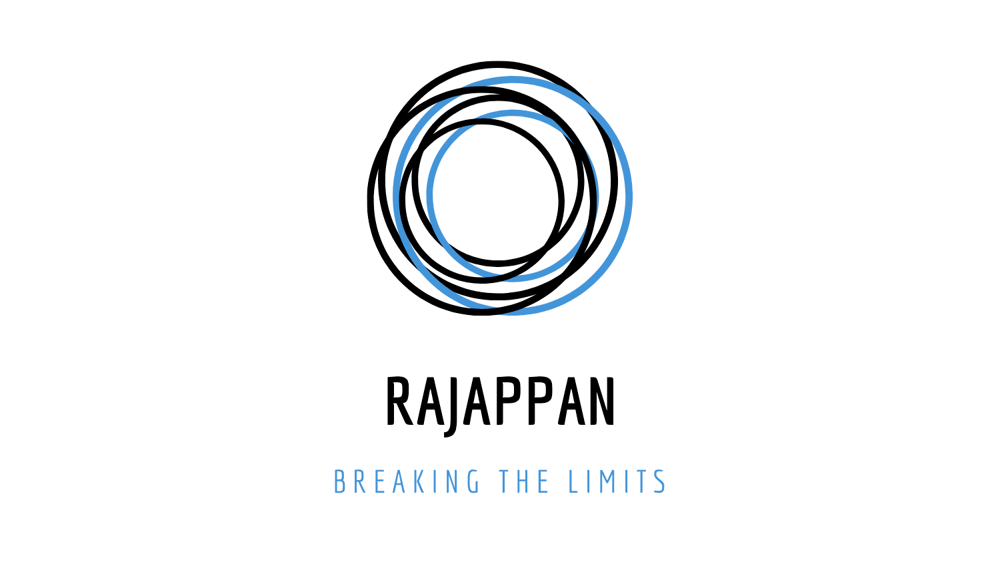

# Cyber-Christmas
```
A Subsidiary of The Rajappan Project
```
<a href='https://ind.ie/ethical-design'></a>


<div style='display: block; width: 300px; margin-left: auto; margin-right: auto;'></div>

## A curated list of resources for Cyber Professionals

Launching on 25th December. Stay Tuned!

----------------------------

### Beginners Cyber Training (For students and new joiners to Cyber Industry)

- [Roppers Academy](https://www.hoppersroppers.org/index.html) - A guide for beginners on their first steps of their journey into cyberspace.

- [Mosse Cyber Security Institute](https://www.mosse-institute.com/certifications/mics-introduction-to-cyber-security.html) - CSI Certification Programs are truly worldclass with cutting-edge content that offers you uniquely-designed, hands-on practical and challenging exercises that teach skills immediately applicable in the field towards benefiting career advancement. 

### Advanced Cyber Training (For Cyber Professionals)

- [CISO Workshop Training](https://docs.microsoft.com/en-us/security/ciso-workshop/ciso-workshop) - The Chief Information Security Office (CISO) workshop contains a collection of security learnings, principles, and recommendations for modernizing security in your organization. This training workshop is a combination of experiences from Microsoft security teams and learnings from customers.

- [Using ATT&CK for Cyber Threat Intelligence Training](https://attack.mitre.org/resources/training/cti/) - This training by Katie Nickels and Adam Pennington of the ATT&CK team will help you learn how to apply ATT&CK and improve your threat intelligence practices. 

- [AttackIQ Academy Badges](https://academy.attackiq.com) - AttackIQ Academy was launched in direct response to the evolution of attackers and their methods in becoming more targeted, sophisticated, and automated.

### Cyber Training

- [NorthSec Trainings](https://www.nsec.io/training-sessions/) - NorthSec is pleased to announce its high-quality training sessions, given by the absolute best experts in their field. We strive to provide you with the highest level of exclusive content, giving you a unique opportunity to improve your applied security knowledge during NorthSec from Tuesday May 24 to Friday May 28.

- [Live Online Cyber Security Training](https://www.sans.org/event/sans-2021-live-online) - SANS 2021 - Live Online Virtual, US Eastern | Mon, Mar 22 - Sat, Mar 27, 2021
SANS is committed to delivering high-quality cyber security training so you can keep your skills sharp and stay ahead of cyber threats. Join us for interactive training during SANS 2021 - Live Online (March 22-27, EDT), and receive relevant, applicable training from wherever you are. Choose your course and register now for practical training taught by top industry practitioners.

### Fun Events

- [Advent of Cyber](https://www.tryhackme.com/christmas) - Advent of Cyber is an event aimed at helping users get started with cyber security, by releasing beginner friendly security exercises every day leading up to Christmas.

- [2020 SANS Holiday Hack Challenge](https://holidayhackchallenge.com/2020/) -Welcome to the 2020 SANS Holiday Hack Challenge, featuring KringleCon 3: French Hens! This year, we're hosting the event at Santa's newly renovated castle at the North Pole.


